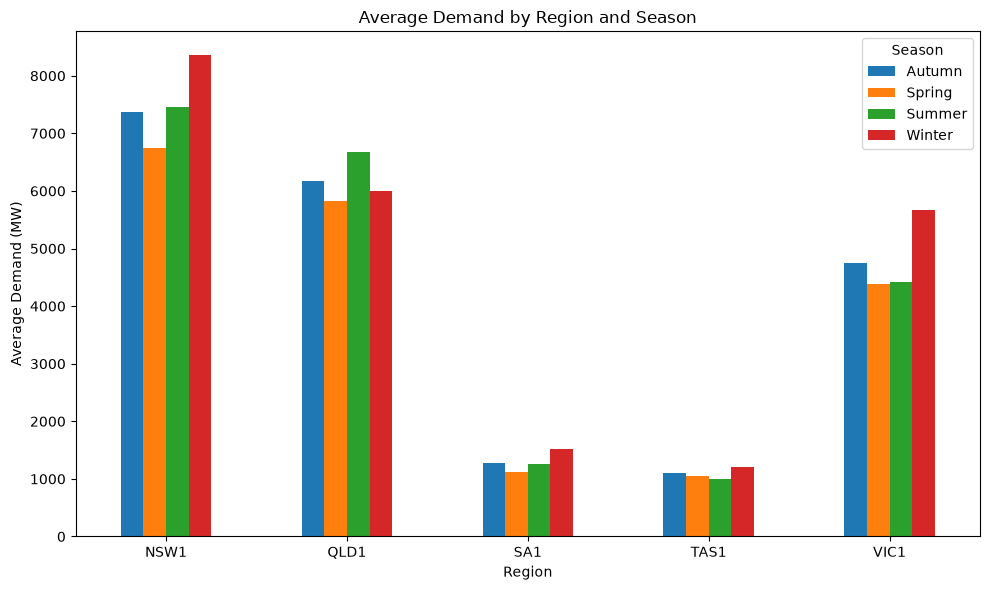
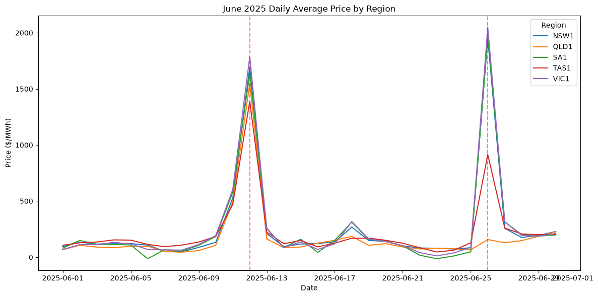
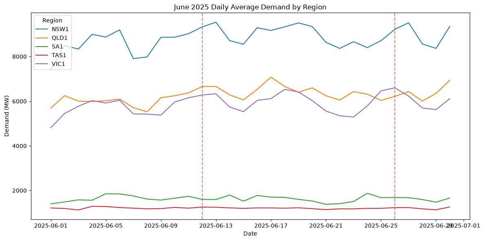

# AEMO Energy Market Analysis

An analysis of Australia's National Electricity Market (NEM) wholesale price and demand data across all 5 regions, from January 2023 through August 2026. Part of a wider project mixing Python, SQL, Excel, and Power BI, moving from raw data acquisition through to a retail pricing model.

**Status: in progress. Data pipeline, core SQL queries, and Python analysis complete. Excel margin model and Power BI dashboard to follow.**

## Data source

AEMO's [Aggregated Price and Demand Data](https://aemo.com.au/energy-systems/electricity/national-electricity-market-nem/data-nem/aggregated-data), published as monthly CSV files per region. Covers NSW1, QLD1, SA1, TAS1, and VIC1, at 5-minute settlement intervals (the format AEMO has used since October 2021, chosen specifically to avoid mixing granularities with the older 30-minute format).

## Data pipeline

- `download_aemo_data.py`: bulk-downloads all monthly files across all 5 regions for the chosen date range directly from AEMO's public URLs, 220 files in total.
- Python (pandas): consolidates all 220 files into one dataset, verifies consistent columns and formats across every file, confirms zero missing values, and builds a calendar dimension (day of week, weekend flag, month, quarter, and Australian season) from the timestamp.
- `PERIODTYPE` was dropped after confirming it never varies across all 1.9 million rows, always `TRADE`.
- Given the dataset's size (1,928,160 rows), data is loaded directly from Python into MySQL via SQLAlchemy rather than MySQL Workbench's Import Wizard.

## Schema

A genuine star schema, the first true fact-and-dimensions design in this portfolio:

- **regions**: 5 rows, one per NEM region.
- **calendar_dim**: 1,340 rows, one per calendar date, holding day of week, weekend flag, month, quarter, and season.
- **readings** (fact table): 1,928,160 rows, one per region per 5-minute settlement period, holding demand and price, foreign keyed to both `regions` and `calendar_dim`.

Known edge case: a small number of boundary readings (5 rows, one per region) are timestamped into 2026-09-01, since AEMO labels each settlement period by its end time rather than its start. This affects one calendar date only and is excluded from any month-level analysis rather than treated as a real month.

## Files

- `download_aemo_data.py`: the bulk data acquisition script, pulls all 220 monthly region files directly from AEMO.
- `combine_data.py`: consolidates the 220 files, runs data quality checks, builds the calendar dimension, and exports three cleaned CSVs.
- `load_to_mysql.py`: loads the cleaned data directly into MySQL via SQLAlchemy, bypassing the Import Wizard given the dataset's size.
- `core_queries.sql`: the four core analytical queries, each preceded by the question it answers.

## Findings so far

- **Average price and demand by region**: NSW1 has both the highest average price ($103.81) and highest average demand (7,535 MW), consistent with it being the largest NEM region. VIC1 has the lowest average price ($68.31) despite the second-highest demand (4,848 MW), likely reflecting its historically heavy reliance on low-cost brown coal baseload generation.
- **Price volatility by month**: varies substantially, from as low as $19 in an excluded partial month to a peak of $994.82 in June 2025, roughly double the next-highest month. Winter months generally trend more volatile, consistent with heating demand spikes and lower solar output, though June 2025 specifically stands out enough to be worth investigating against real grid events.
- **Negative price events**: all four mainland regions bottom out at exactly -$1,000.00, AEMO's regulatory Market Price Floor. SA1 recorded negative prices in 26% of all its settlement periods, the highest by far, consistent with South Australia's very high rooftop solar and wind penetration relative to grid size. TAS1, predominantly hydro-powered, saw negative prices in under 5% of periods and never touched the exact price floor.
- **Demand-price correlation**: positive in every region, as expected, but weak everywhere (0.12 to 0.23), confirming that price is driven by far more than demand alone. VIC1 shows the strongest relationship (0.235), TAS1 the weakest (0.120), plausibly reflecting Tasmania's hydro generation responding to water availability as much as real-time demand.

## Python analysis findings

- **Seasonal demand by region**: nationally, winter shows the highest average demand (4,550 MW) and spring the lowest (3,827 MW). This is partly a visibility effect rather than pure consumption, `TOTALDEMAND` only measures electricity drawn from the grid, and rooftop solar (invisible to this dataset, since it's consumed directly at the household) offsets a large share of summer cooling load before it ever reaches the grid.
- **QLD1 breaks the national pattern entirely**: it is the only region where summer, not winter, is the peak demand season (6,668 MW vs 5,995 MW), consistent with its subtropical climate and cooling-dominated load.

- **The June 2025 volatility spike (STDDEV of $994.82) is a real, documented market event, not a data artefact.** Wholesale prices rose nationally that month due to coal generator outages coinciding with unusually low wind output; average prices increased 77% in QLD and up to 239% in VIC compared to typical levels, and June 2025 was later used as the reference point for "exceptionally elevated" pricing in a subsequent year-on-year market review.
- **Daily breakdown reveals two distinct events inside that one volatile month**:
  - **June 11-12**: a genuine NEM-wide event. All 5 regions spike together, mean prices jumping from a normal ~$70-150/MWh to $1,300-1,800/MWh, with every region's maximum reaching $16,000-17,500/MWh. VIC1's maximum of exactly $17,500.00 matches the Market Price Cap in effect at the time, confirming the market hit its literal regulatory ceiling that day, the same kind of hard regulatory limit as the -$1,000 Market Price Floor seen in the negative pricing analysis, just the opposite extreme.
  - **June 26**: a regionally contained event. NSW1, SA1, and VIC1 spike hard (means around $1,950-2,050/MWh) and TAS1 spikes moderately (914/MWh), but QLD1 is essentially untouched (mean $156, max $3,237, both unremarkable for a winter day).

- **Demand data rules out the obvious alternative explanation for both spikes.** Every region's demand stayed within its normal seasonal range on both June 11-12 and June 26, no region shows a demand spike or dip coinciding with the price events. This confirms both events were supply-driven (outages, low wind, and whatever specifically affected the southern/eastern states on the 26th), not demand-driven. QLD1's demand on June 26th sits comfortably inside its usual band, supporting the theory that QLD was isolated from the event by the NEM's limited interconnector capacity between regions, rather than having simply absorbed it via spare local generation.

## Next steps

Excel: a retail pricing/margin calculator, translating wholesale price behaviour into what a retailer would need to charge.

Power BI: a regional market dashboard covering price and demand trends, volatility, and negative price events.
